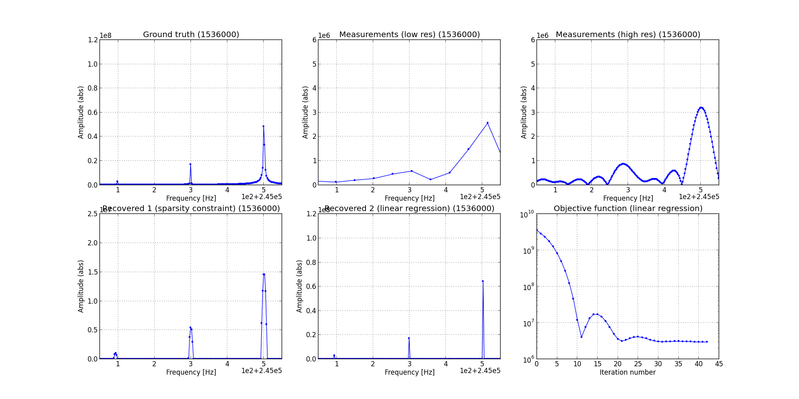

# srfsp: super-resolution for mass spectrometry

To reduce measurement time, the software of a spectrometer should be able to
recover diracs (which identify the measured material) in a low-resolution
Fourier spectrum. Shorter is the measurement, lower is the spectrum resolution.
The goal of this project is to recover those diracs at the lowest possible
resolution, assuming that the signal is sparse in the Fourier domain, i.e. that
the measured compound is composed of only a tiny set of elements. A side goal
is to test and enhance our convex optimization package.

Steps:

1. Artificially increase the resolution by adding zeros at the end of the
   measurement (corresponds to a convolution with a sinc in the Fourier domain).
2. Search for the signal which minimizes the reconstruction error (in the
   time domain) while being sparse (in the Fourier domain). The optimization
   problem becomes convex if we use an l1 penalty as a proxy for the number of
   non-zero elements.
3. Regroup the aggregates into a single dirac.
4. Estimate the amplitudes of the identified diracs through linear regression.

## Dependencies

* [PyUNLocBoX](https://github.com/epfl-lts2/pyunlocbox): convex optimization
* [numpy](http://www.numpy.org/): scientific computing
* [matplotlib](http://matplotlib.org/): plotting
* [h5py](http://www.h5py.org/): data storage
